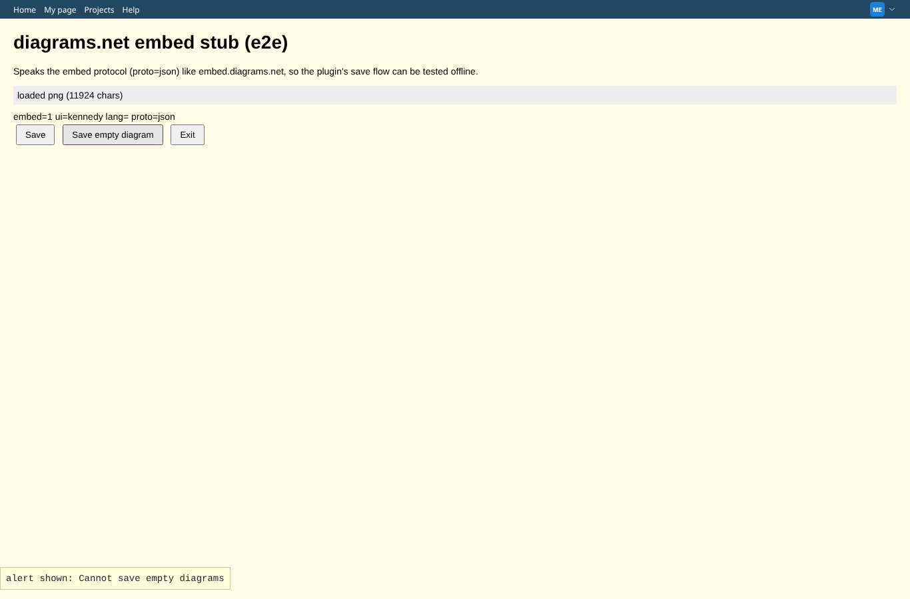
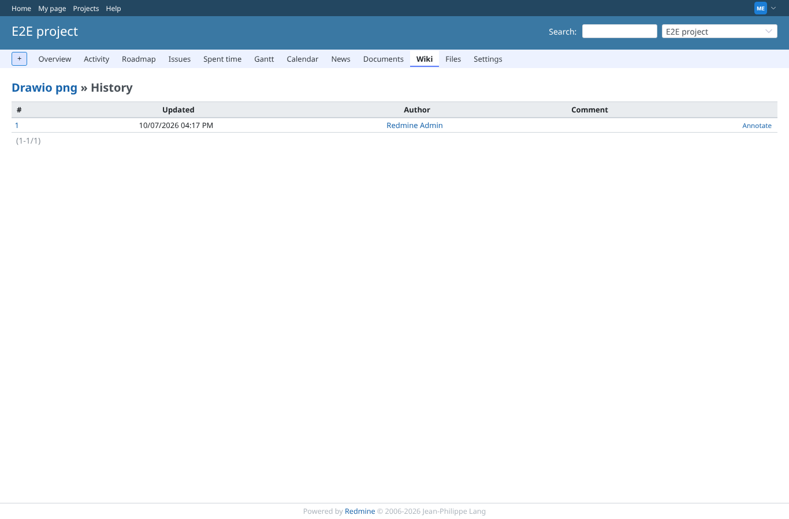

# editor-cancel-empty

Run 2026-10-07T16:18:32.330Z against http://127.0.0.1:3000.

| screenshot | user | URL | shows |
|---|---|---|---|
|  | manager | `/projects/e2e-project/wiki/Drawio_png` | Saving an empty diagram is refused with an alert ("Cannot save empty diagrams"); the editor stays open |
|  | manager | `/projects/e2e-project/wiki/Drawio_png/history` | Exit closes the editor; no new version in the page history |
