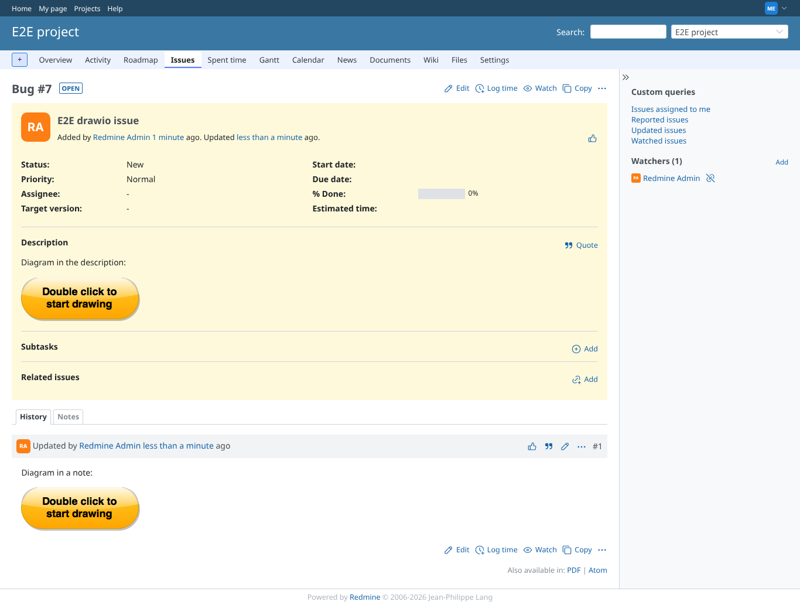
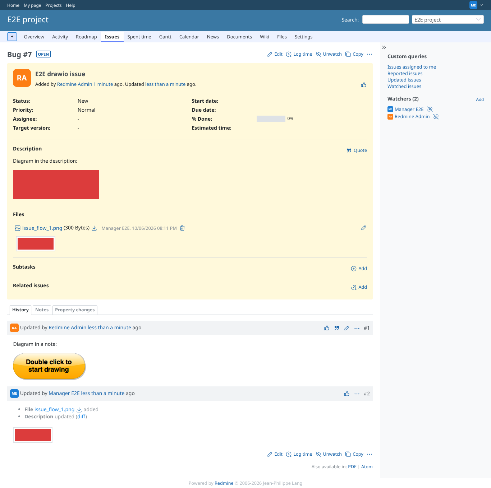
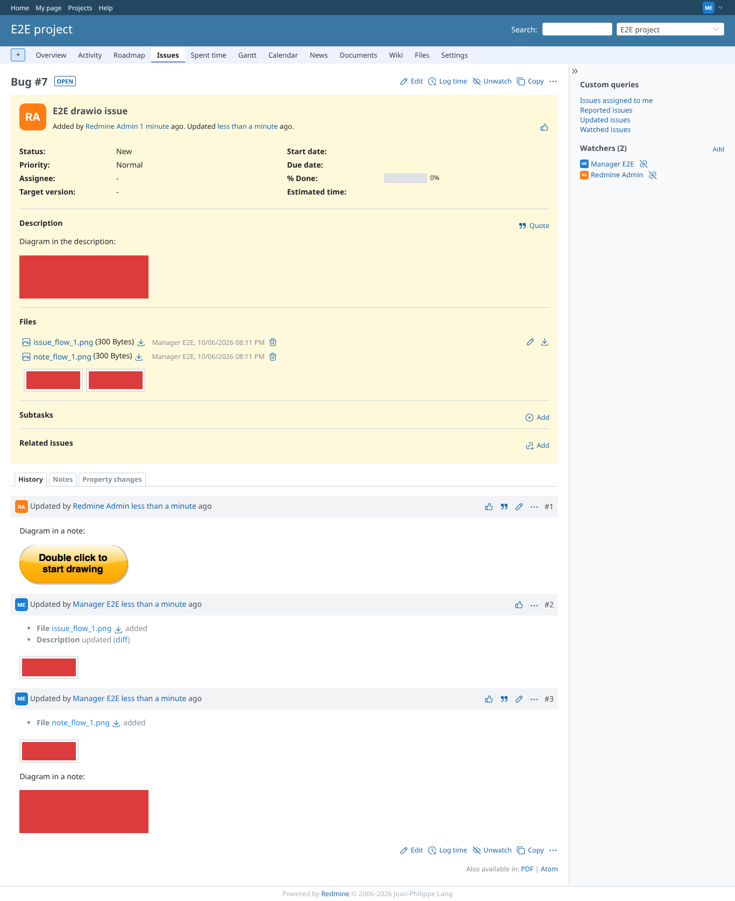
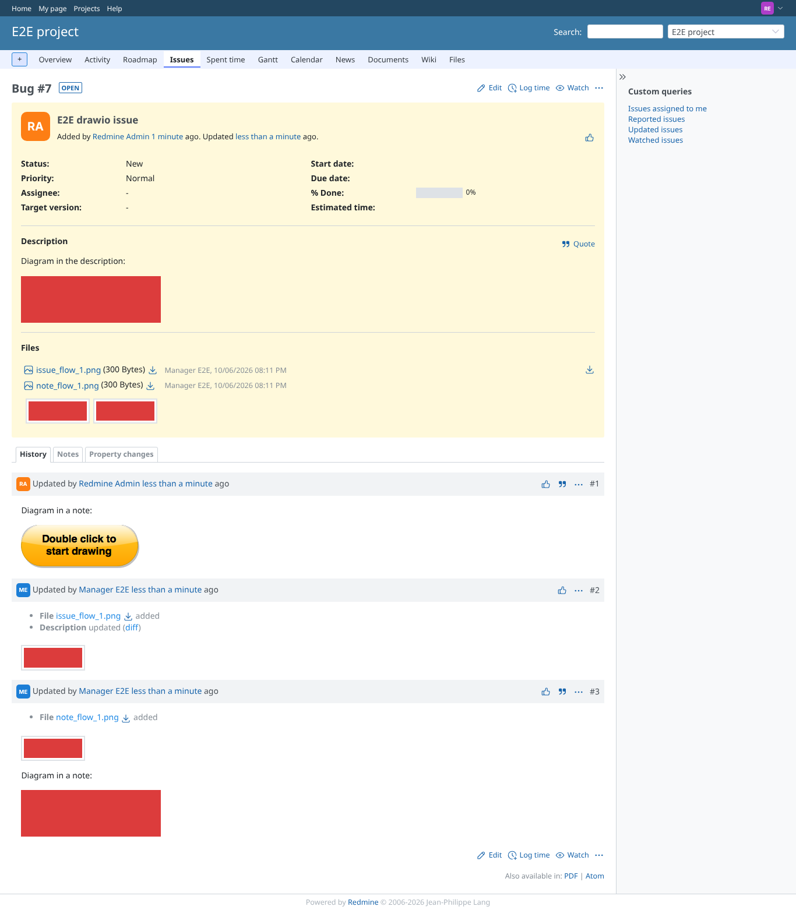

# issue-edit-save

Run 2026-10-06T20:12:05.605Z against http://127.0.0.1:3000.

| screenshot | user | URL | shows |
|---|---|---|---|
|  | manager | `/issues/7` | Issue with a diagram in the description and one in a note (default images, editable) |
|  | manager | `/issues/7` | After saving the description diagram: red diagram, issue_flow_1.png attached, history entry |
|  | manager | `/issues/7` | After saving the note diagram: a new note references note_flow_1.png, both attachments listed |
|  | reporter | `/issues/7` | reporter (add_issue_notes only): Issue#editable? is true, so the issue diagrams are editable for him too |
