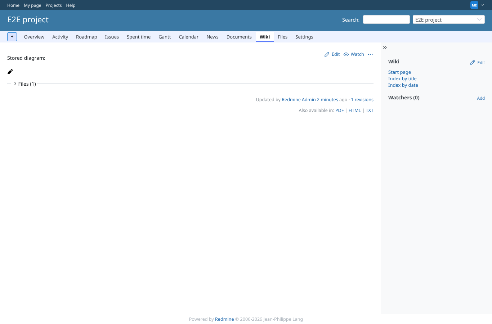
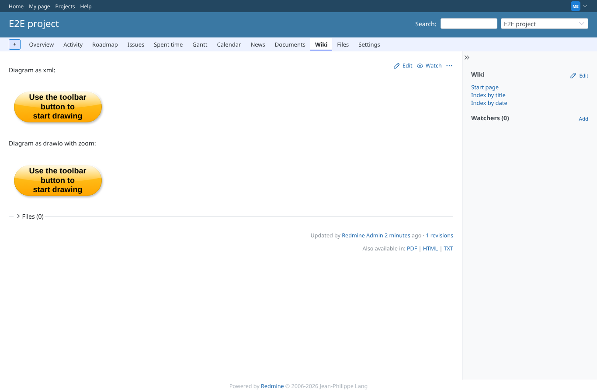
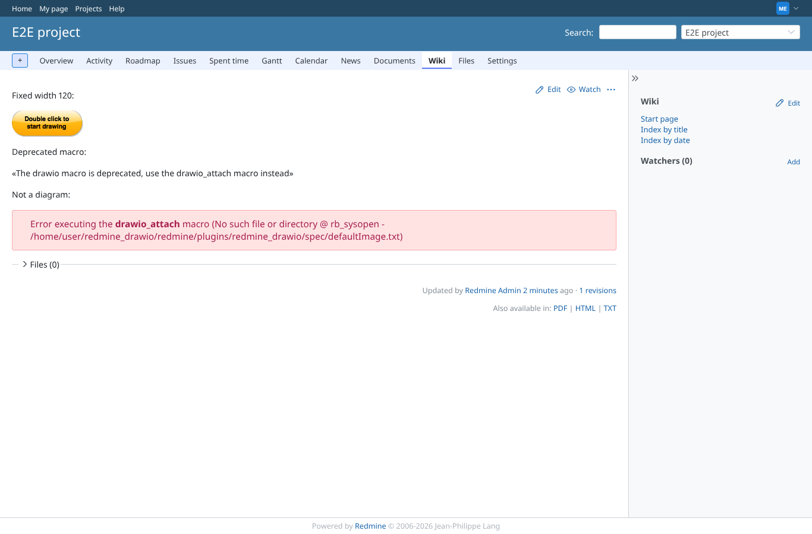
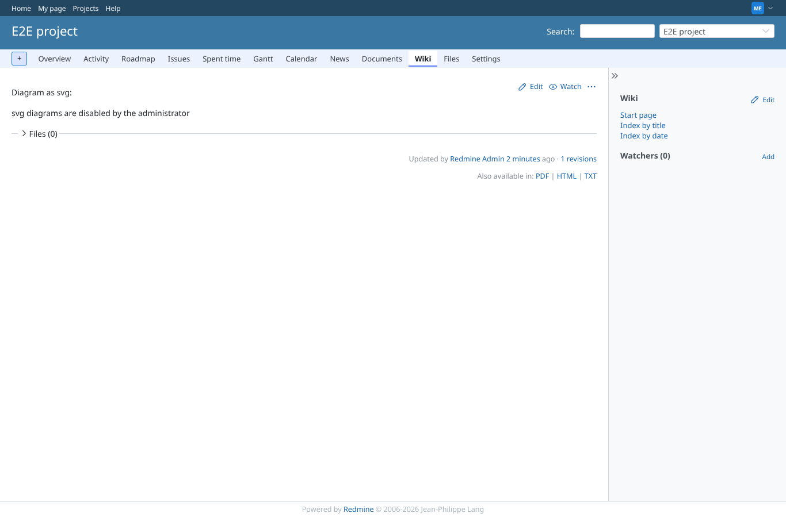
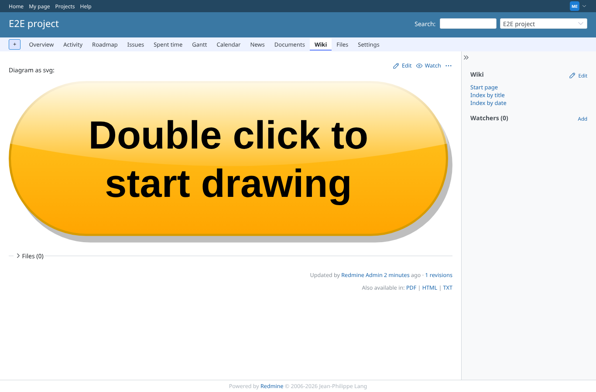
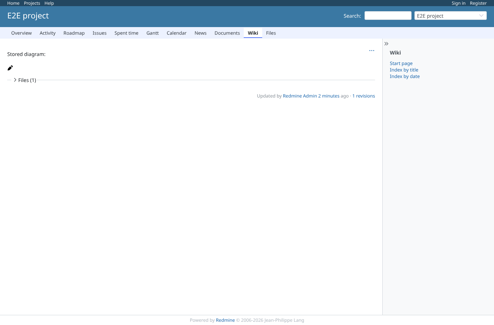

# macro-rendering

Run 2026-10-06T20:12:30.885Z against http://127.0.0.1:3000.

| screenshot | user | URL | shows |
|---|---|---|---|
|  | manager | `/projects/e2e-project/wiki/Drawio_attached` | Existing attachment stored.png (16x16 icon) rendered inline as a data: png |
|  | manager | `/projects/e2e-project/wiki/Drawio_xml` | flow.xml and other.drawio (zoom=true) drawn by the diagrams.net viewer (viewer-static.min.js from the service URL) |
|  | manager | `/projects/e2e-project/wiki/Drawio_options` | size=120 gives a 120px wide diagram; the deprecated drawio macro shows its message; notes.txt shows a macro error (see caption in plan) |
|  | manager | `/projects/e2e-project/wiki/Drawio_svg` | With the svg setting off the svg macro is refused with a message |
|  | manager | `/projects/e2e-project/wiki/Drawio_svg` | With the svg setting on the default svg diagram is rendered inline (span.drawioDiagram > svg), without DOCTYPE text above it |
|  | anonymous | `/projects/e2e-project/wiki/Drawio_attached` | Anonymous on a public project sees the diagram, not editable (no title, no editor script) |
