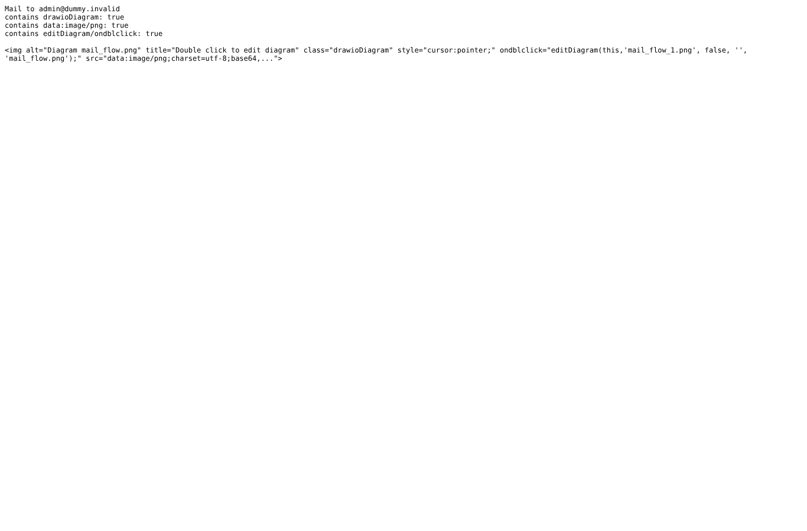

# mail-notification

Run 2026-10-06T20:19:42.192Z against http://127.0.0.1:3000.

| screenshot | user | URL | shows |
|---|---|---|---|
|  | manager | `/issues/7` | Notification mail for the note: the diagram is inline as a data: png (editor attributes present for a recipient who may edit, inert in mail) |
