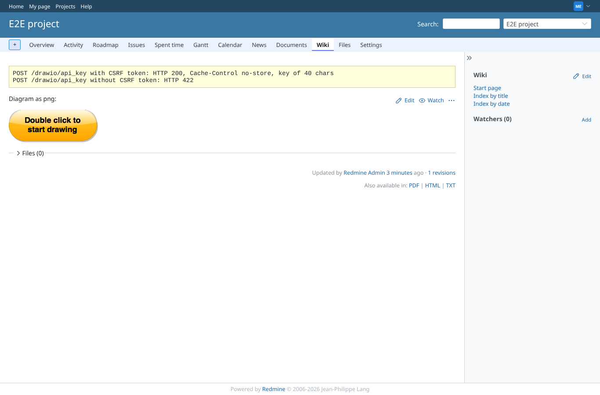
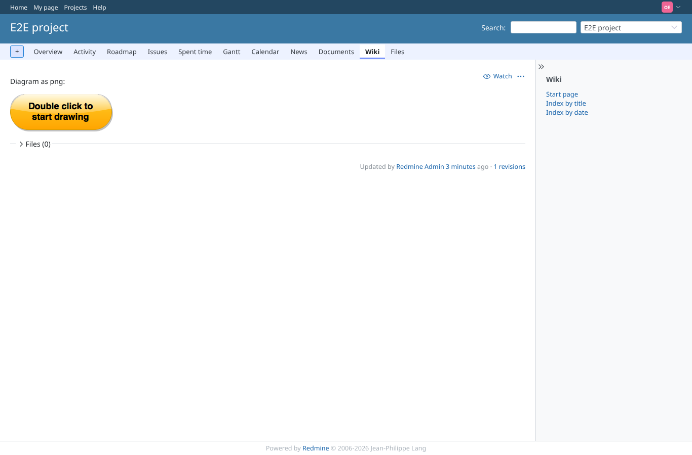
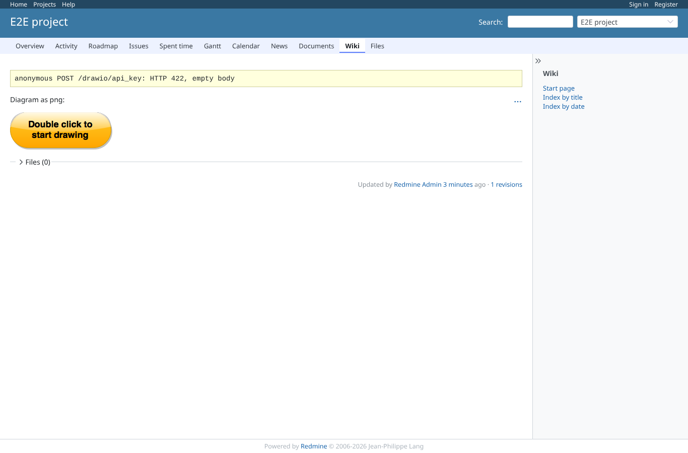

# permissions

Run 2026-10-06T21:10:10.824Z against http://127.0.0.1:3000.

| screenshot | user | URL | shows |
|---|---|---|---|
|  | manager | `/projects/e2e-project/wiki/Drawio_png` | manager: editable diagram; the key comes only from POST /drawio/api_key (200 no-store with CSRF token, 422 without) |
|  | reporter | `/projects/e2e-project/wiki/Drawio_png` | reporter (no edit_wiki_pages): diagram shown read-only, no editor scripts on the page |
|  | outsider | `/projects/e2e-private/wiki/Drawio_private` | outsider: the private project wiki page with a diagram is refused (403) |
|  | outsider | `/projects/e2e-project/wiki/Drawio_png` | outsider on the public project: diagram read-only |
|  | anonymous | `/projects/e2e-project/wiki/Drawio_png` | anonymous: diagram read-only, the API key endpoint is refused |
