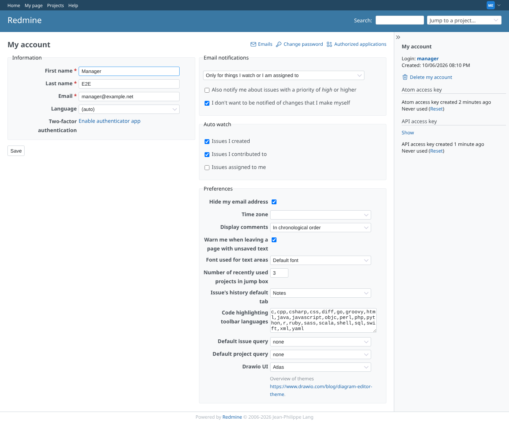
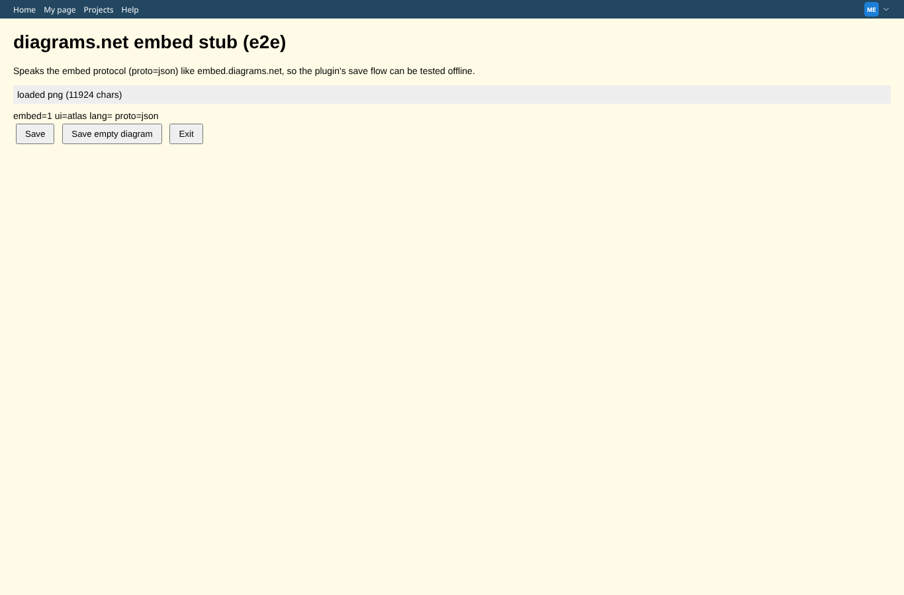

# my-account-ui

Run 2026-10-06T20:13:10.410Z against http://127.0.0.1:3000.

| screenshot | user | URL | shows |
|---|---|---|---|
|  | manager | `/my/account` | My account > Preferences: Drawio UI select (Default, Atlas, Simple, Minimal, Sketch), Atlas chosen |
|  | manager | `/projects/e2e-project/wiki/Drawio_png` | The editor is opened with ui=atlas |
