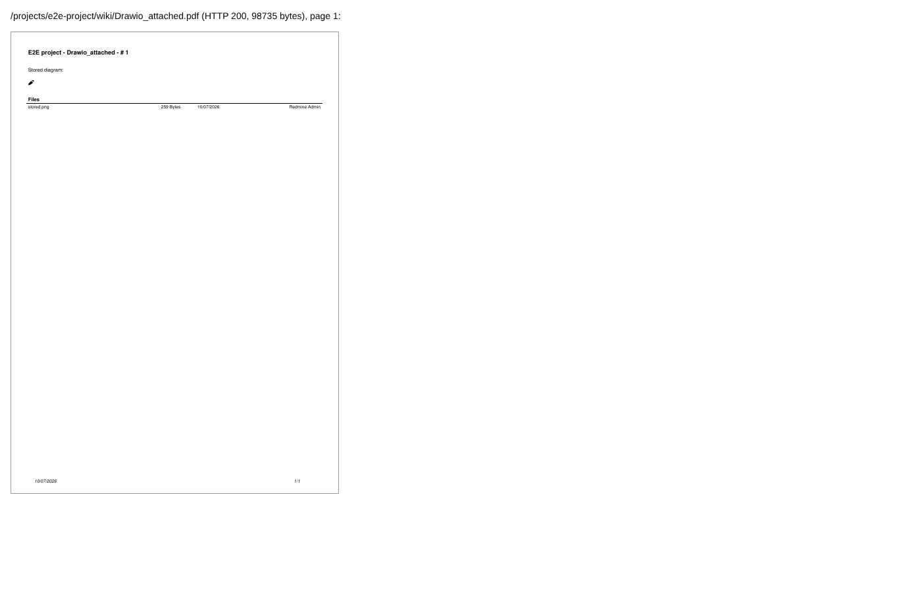
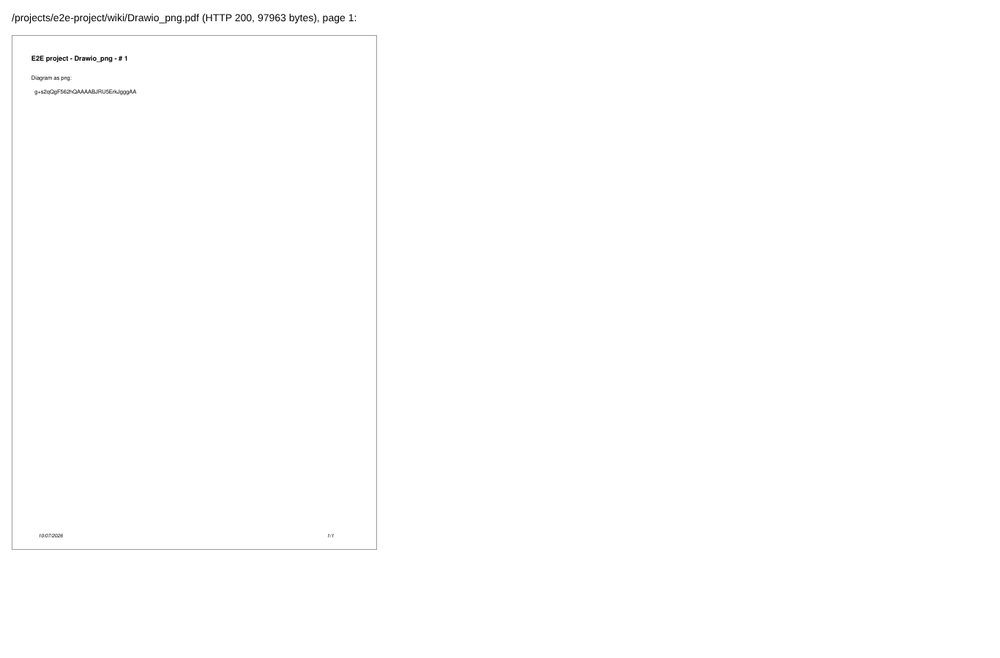
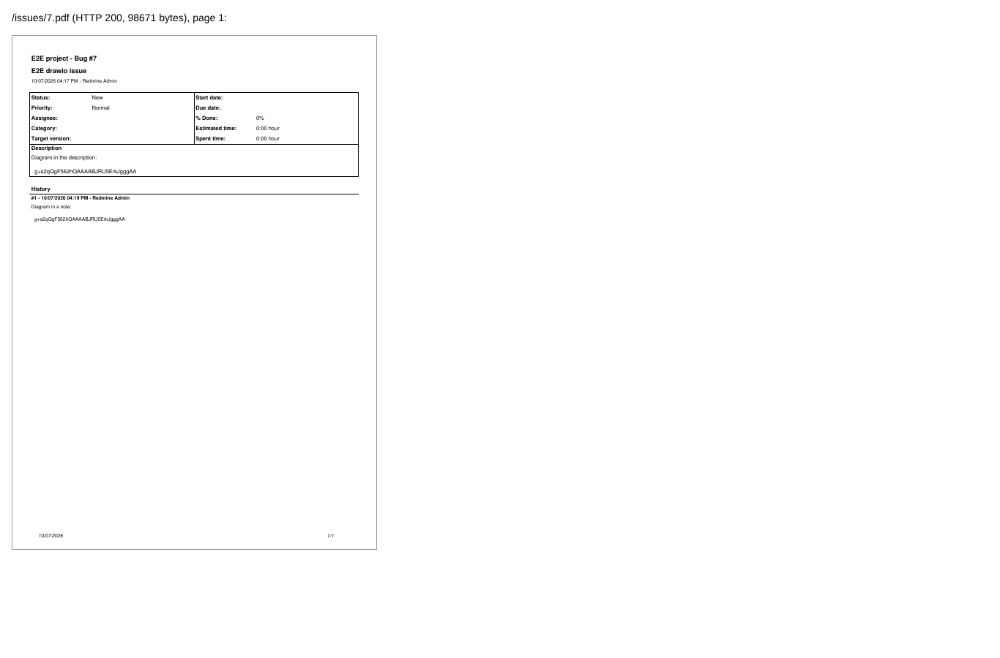

# pdf-export

Run 2026-10-07T16:19:56.480Z against http://127.0.0.1:3000.

| screenshot | user | URL | shows |
|---|---|---|---|
|  | manager | `/projects/e2e-project/wiki/Drawio_attached` | Wiki PDF: the stored diagram (stored.png, 16x16 icon) is in the PDF |
|  | manager | `/projects/e2e-project/wiki/Drawio_png` | Wiki PDF of a page whose diagram has no attachment yet |
|  | manager | `/issues/7` | Issue PDF with the diagrams of description and note |
