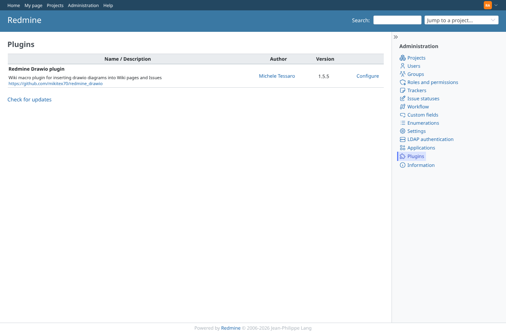
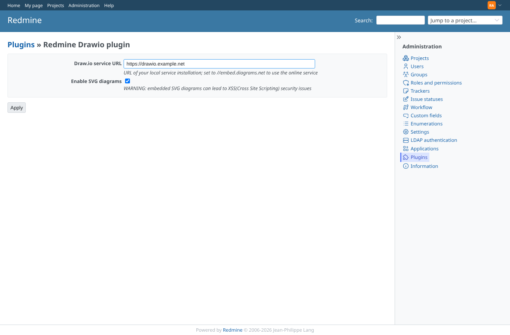
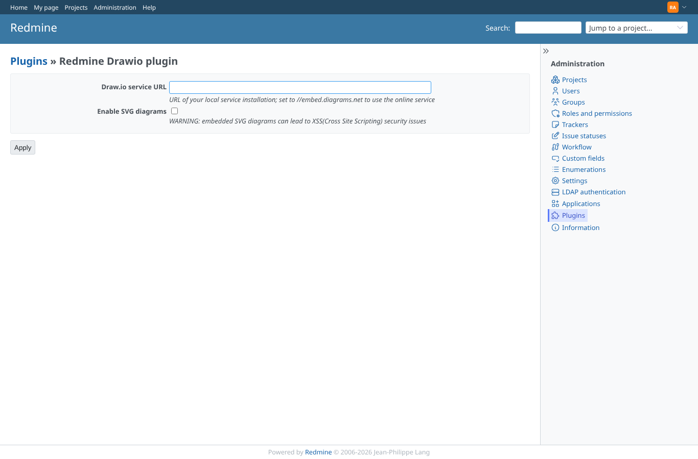

# plugin-settings

Run 2026-10-07T16:20:23.534Z against http://127.0.0.1:3000.

| screenshot | user | URL | shows |
|---|---|---|---|
|  | admin | `/admin/plugins` | Administration > Plugins lists Redmine Drawio plugin 1.5.5 with Configure |
|  | admin | `/settings/plugin/redmine_drawio` | Settings saved: service URL https://drawio.example.net, SVG enabled |
|  | admin | `/settings/plugin/redmine_drawio` | Empty URL saved; the hint shows the default //embed.diagrams.net that is then used |
|  | manager | `/settings/plugin/redmine_drawio` | manager (not admin) is refused the plugin settings (403) |
