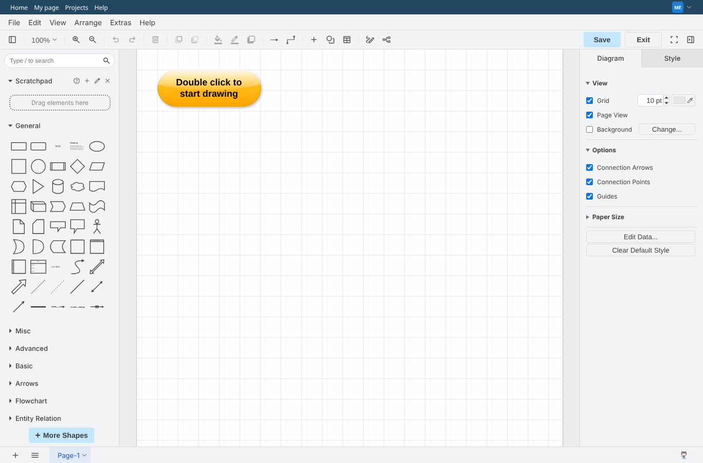
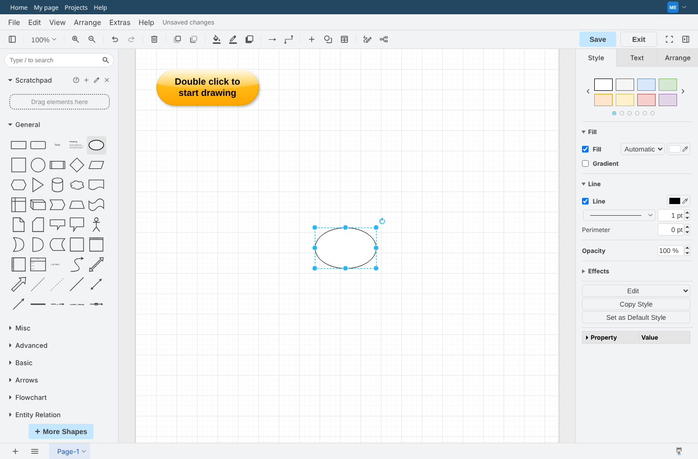
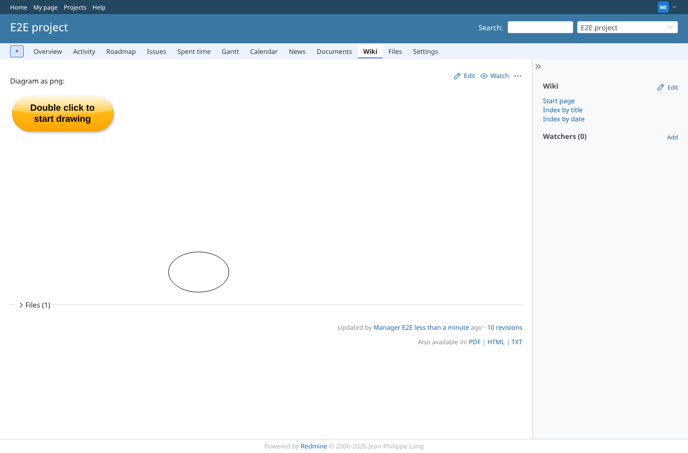

# real-diagrams-net

Run 2026-10-06T20:31:13.964Z against http://127.0.0.1:3000.

| screenshot | user | URL | shows |
|---|---|---|---|
|  | manager | `/projects/e2e-project/wiki/Drawio_png` | Double click opens the real diagrams.net editor (embed.diagrams.net, ui=kennedy) with the default diagram |
|  | manager | `/projects/e2e-project/wiki/Drawio_png` | An ellipse added in the editor before saving |
|  | manager | `/projects/e2e-project/wiki/Drawio_png` | Saved through the real editor: flow_1.png (png with the diagram source embedded) attached and shown with the added ellipse |
