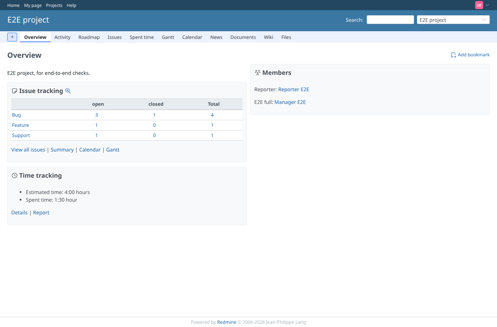
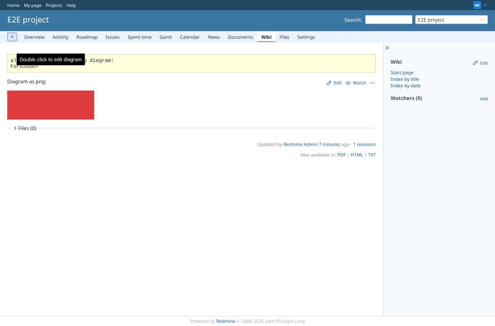
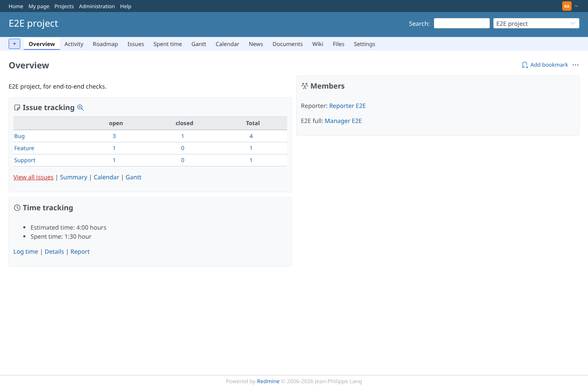

# rest-api-disabled

Run 2026-10-07T16:05:03.063Z against http://127.0.0.1:3000.

| screenshot | user | URL | shows |
|---|---|---|---|
|  | admin | `/projects/e2e-project` | REST API off: the admin sees the drawio warning, pointing to Administration -> Settings -> Integrations (the Redmine 7 tab) |
|  | outsider | `/projects/e2e-project` | REST API off: reporter and outsider get no warning (outsider shown) |
|  | manager | `/projects/e2e-project/wiki/Drawio_png` | manager, REST off: saving shows the alert "Error saving diagram: Forbidden" (the diagram is already replaced in the page, nothing is stored); no warning banner for non-admins |
|  | admin | `/projects/e2e-project` | REST API on again: no warning |
