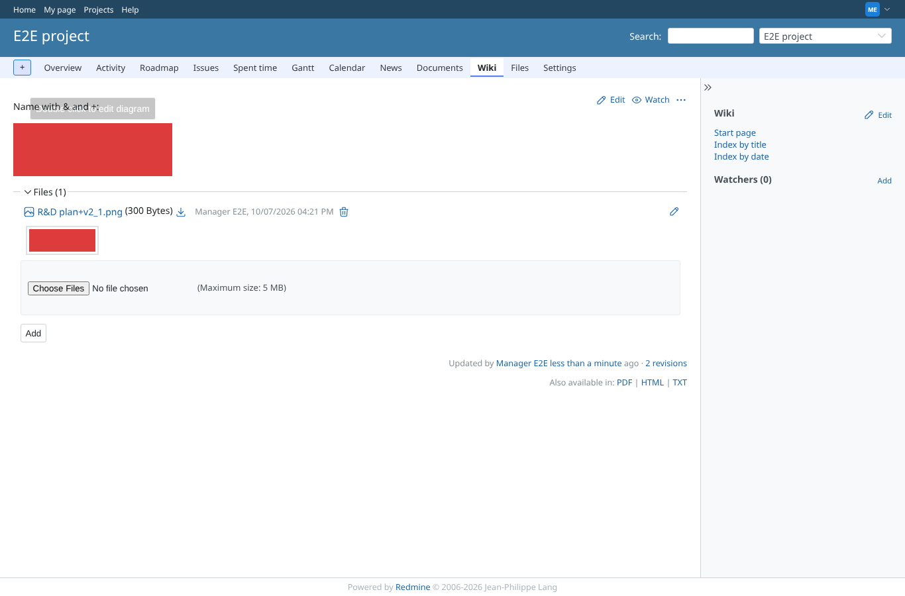

# special-filename

Run 2026-10-07T16:21:23.048Z against http://127.0.0.1:3000.

| screenshot | user | URL | shows |
|---|---|---|---|
|  | manager | `/projects/e2e-project/wiki/Drawio_name` | Upload /uploads.json?filename=R%26D%20plan%2Bv2_1.png: the attachment keeps its full name "R&D plan+v2_1.png", image type and thumbnail |
