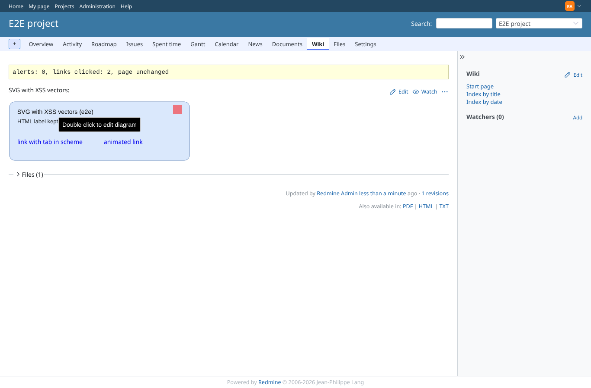
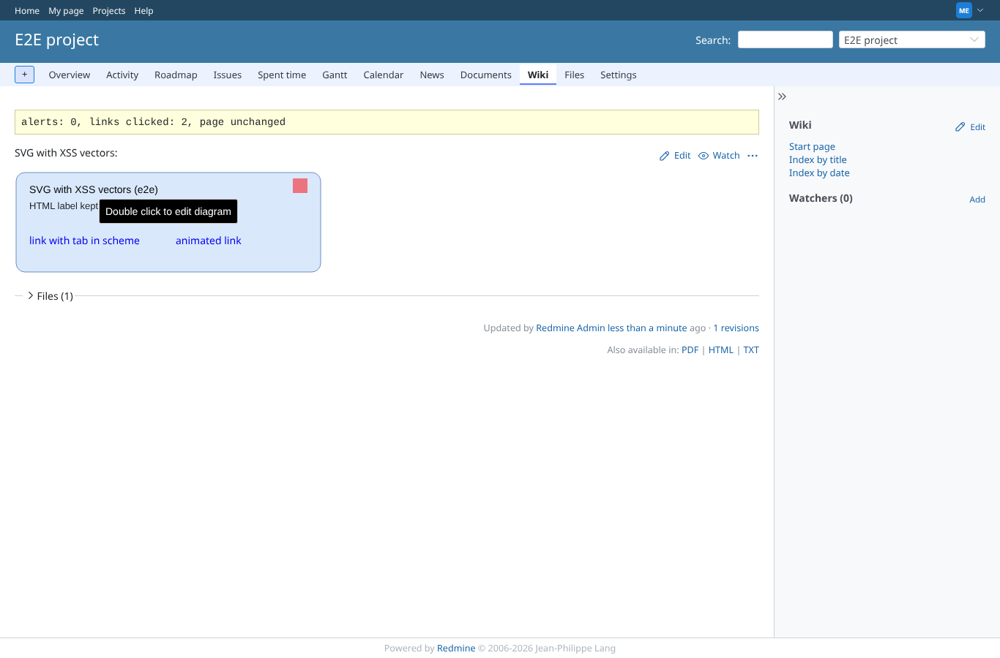
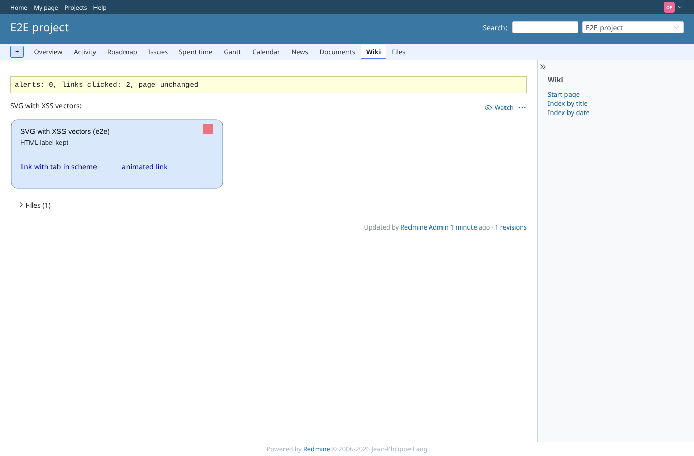

# svg-sanitizer

Run 2026-10-07T15:58:41.666Z against http://127.0.0.1:3000.

| screenshot | user | URL | shows |
|---|---|---|---|
|  | admin | `/projects/e2e-project/wiki/Drawio_svg_xss` | admin: SVG with XSS vectors shown inline (svg setting on); no script ran, the links do nothing; shapes, html label and data: image kept |
|  | manager | `/projects/e2e-project/wiki/Drawio_svg_xss` | manager: SVG with XSS vectors shown inline (svg setting on); no script ran, the links do nothing; shapes, html label and data: image kept |
|  | reporter | `/projects/e2e-project/wiki/Drawio_svg_xss` | reporter: SVG with XSS vectors shown inline (svg setting on); no script ran, the links do nothing; shapes, html label and data: image kept |
|  | outsider | `/projects/e2e-project/wiki/Drawio_svg_xss` | outsider: SVG with XSS vectors shown inline (svg setting on); no script ran, the links do nothing; shapes, html label and data: image kept |
