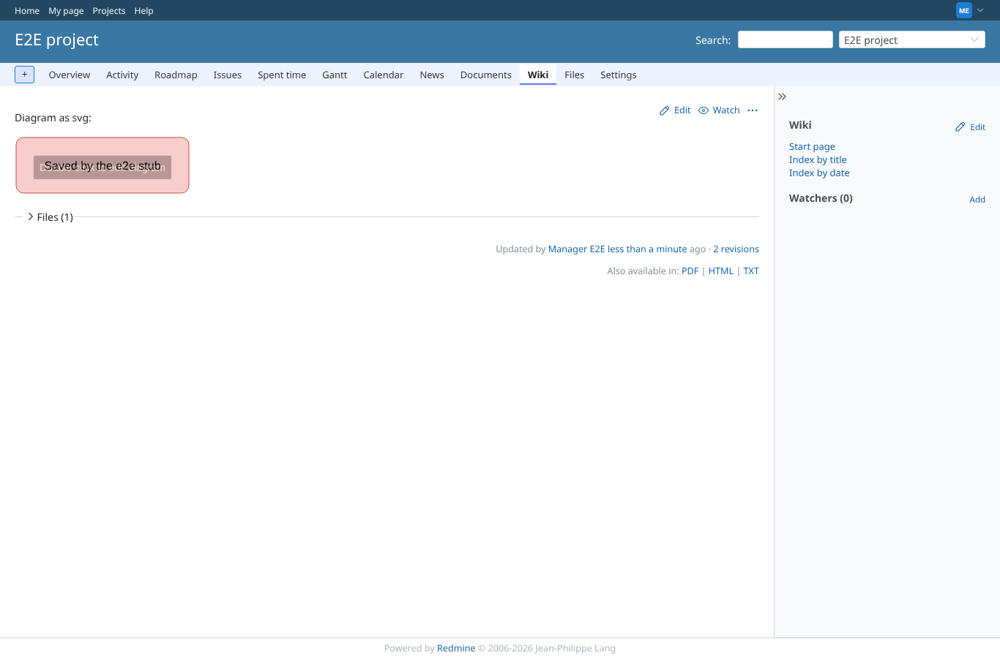
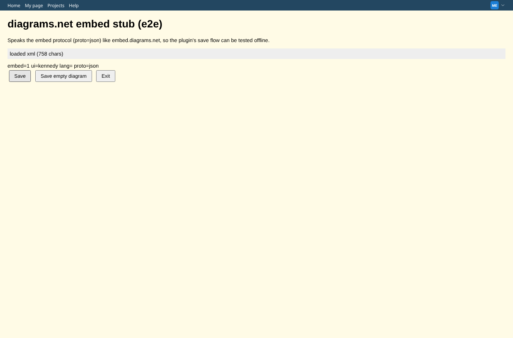
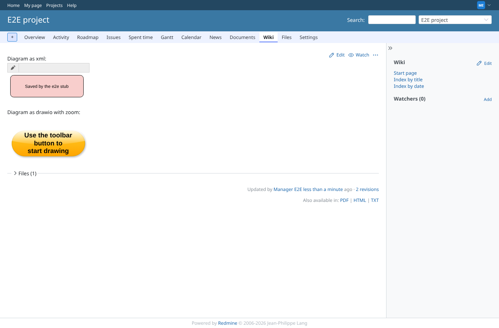

# svg-xml-edit-save

Run 2026-10-07T16:22:14.794Z against http://127.0.0.1:3000.

| screenshot | user | URL | shows |
|---|---|---|---|
|  | manager | `/projects/e2e-project/wiki/Drawio_svg` | svg diagram saved as flow_1.svg and rendered inline after reload ("Saved by the e2e stub") |
|  | manager | `/projects/e2e-project/wiki/Drawio_xml` | The viewer toolbar Edit button opens the editor with the xml loaded |
|  | manager | `/projects/e2e-project/wiki/Drawio_xml` | xml diagram saved as flow_1.xml; the viewer draws "Saved by the e2e stub" |
