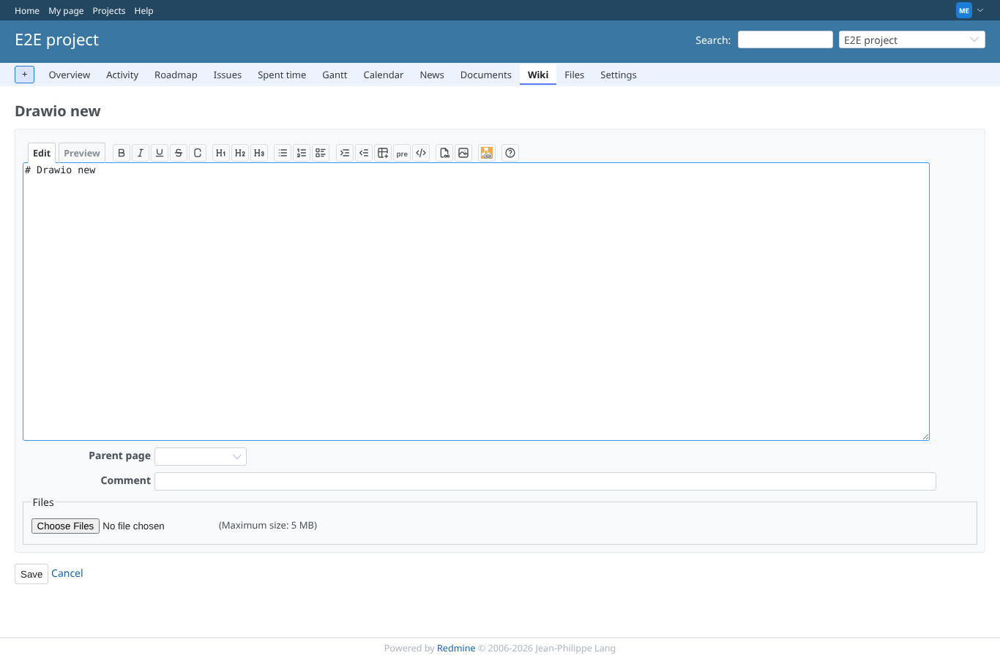
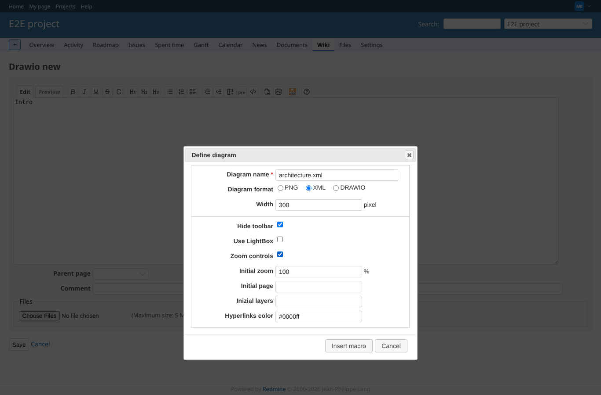
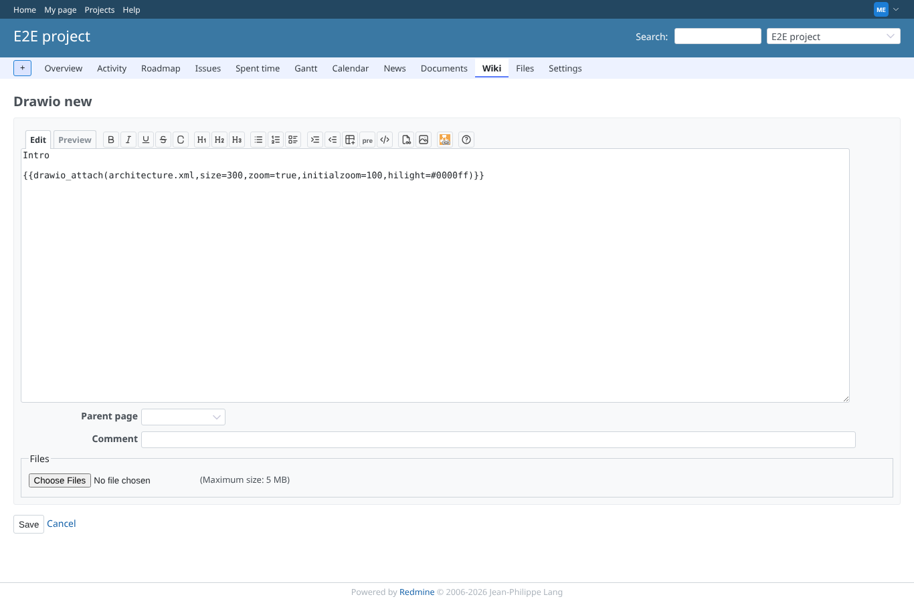
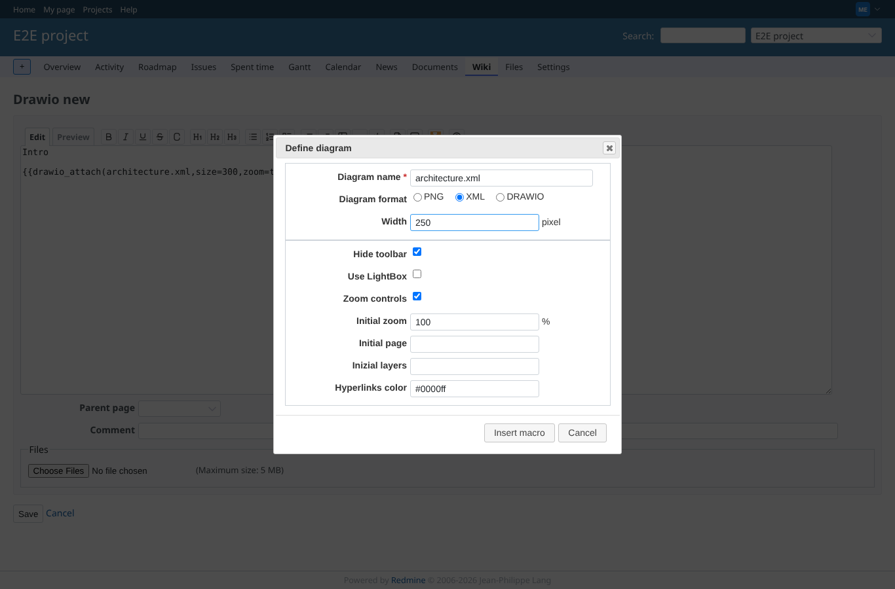
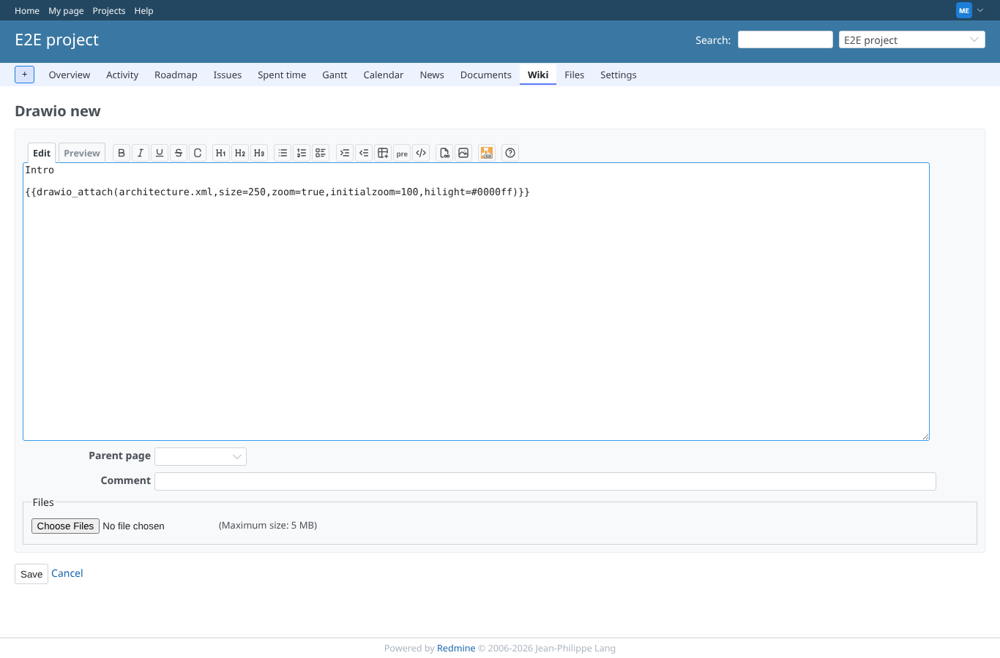
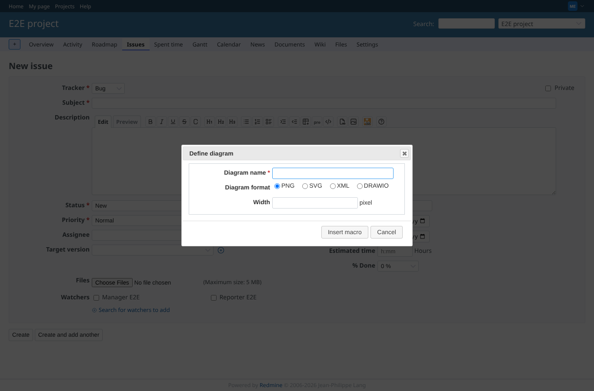

# toolbar-macro-dialog

Run 2026-10-06T21:05:36.558Z against http://127.0.0.1:3000.

| screenshot | user | URL | shows |
|---|---|---|---|
|  | manager | `/projects/e2e-project/wiki/Drawio_new/edit` | Wiki editor toolbar with the drawio button (last icon) |
|  | manager | `/projects/e2e-project/wiki/Drawio_new/edit` | Macro dialog: name, type XML (xml options shown), size 300, zoom on; no SVG choice while svg is disabled |
|  | manager | `/projects/e2e-project/wiki/Drawio_new/edit` | Inserted: {{drawio_attach(architecture.xml,size=300,zoom=true,initialzoom=100,hilight=#0000ff)}} |
|  | manager | `/projects/e2e-project/wiki/Drawio_new/edit` | Caret inside the macro: the dialog opens with its values, size changed to 250 |
|  | manager | `/projects/e2e-project/wiki/Drawio_new/edit` | Edited in place: {{drawio_attach(architecture.xml,size=250,zoom=true,initialzoom=100,hilight=#0000ff)}} |
|  | manager | `/projects/e2e-project/issues/new` | New issue form: the same button; with svg enabled the dialog offers SVG |
