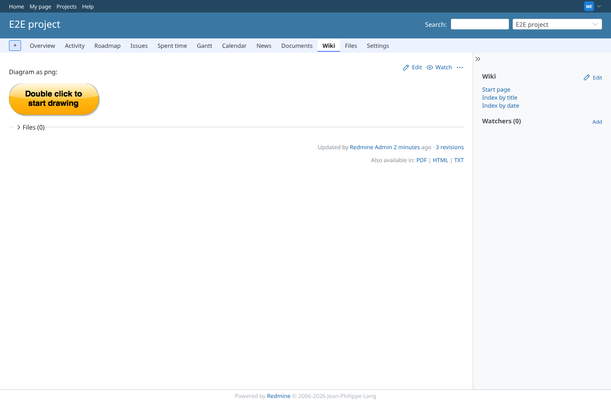
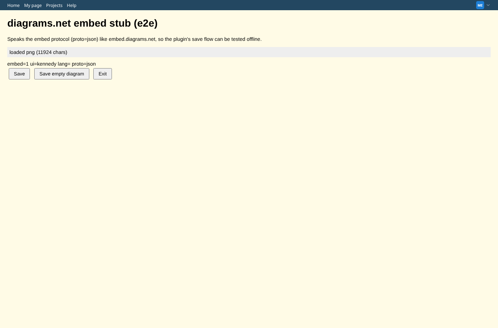
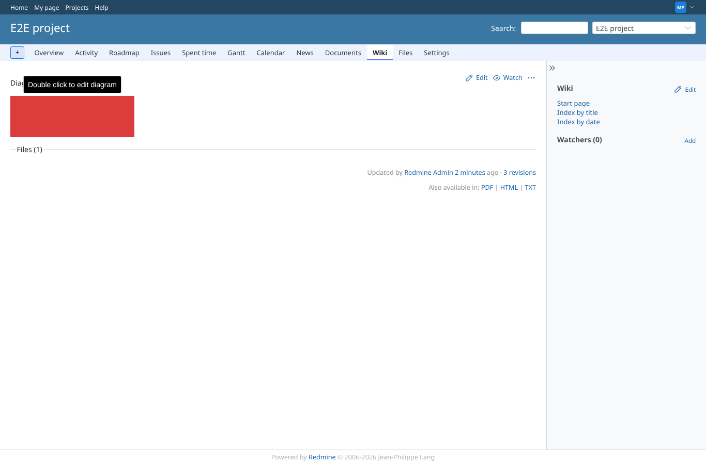
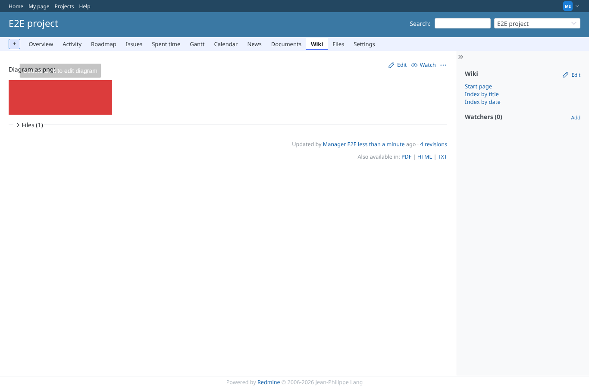
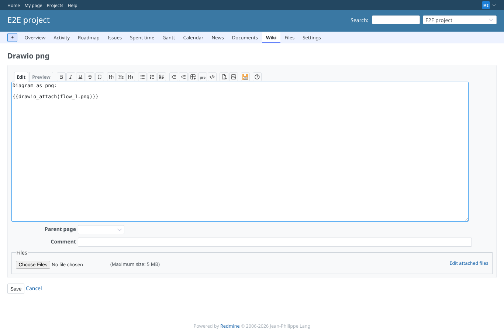
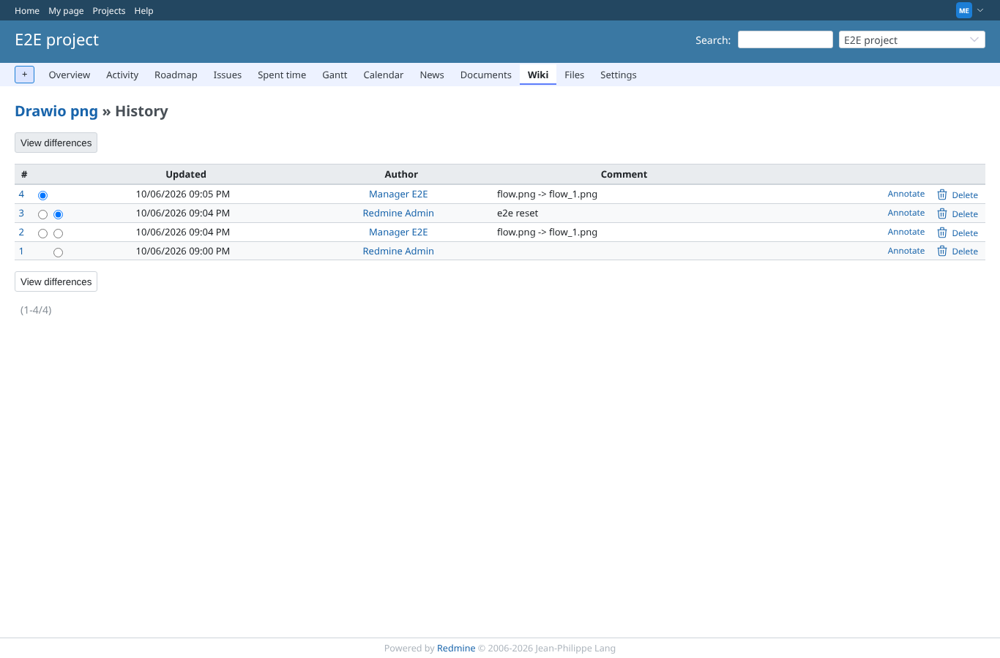

# wiki-png-edit-save

Run 2026-10-06T21:06:01.248Z against http://127.0.0.1:3000.

| screenshot | user | URL | shows |
|---|---|---|---|
|  | manager | `/projects/e2e-project/wiki/Drawio_png` | Missing flow.png: the default diagram is shown, editable (title "Double click to edit diagram") |
|  | manager | `/projects/e2e-project/wiki/Drawio_png` | Double click opens the editor iframe (stub) with the png loaded, ui=kennedy, lang=en |
|  | manager | `/projects/e2e-project/wiki/Drawio_png` | After Save: editor closed, the red diagram shown in place, attachment list updated without reload |
|  | manager | `/projects/e2e-project/wiki/Drawio_png` | Reloaded: the page now shows flow_1.png (attachment listed) |
|  | manager | `/projects/e2e-project/wiki/Drawio_png/edit` | The page source now references {{drawio_attach(flow_1.png)}} |
|  | manager | `/projects/e2e-project/wiki/Drawio_png/history` | Wiki history: new version with comment "flow.png -> flow_1.png" by manager |
